<div align="center">



<a href="https://git.io/typing-svg">
  
</a>

<br/><br/>

<a href="https://personal-portfolio-five-liard-62.vercel.app"></a>
<a href="https://linkedin.com/in/gnandakishorereddy"></a>
<a href="https://dev.to/n9601"></a>
<a href="mailto:nandakishorereddyg@outlook.com"></a>
<a href="https://personal-portfolio-five-liard-62.vercel.app/Nandakishore_Reddy_CV.pdf"></a>

</div>


### `$ neofetch`

<p align="center">
<picture>
  <source media="(prefers-color-scheme: dark)" srcset="assets/neofetch-dark.svg"/>
  <source media="(prefers-color-scheme: light)" srcset="assets/neofetch-light.svg"/>
  
</picture>
</p>

<sub><p align="center">stats refresh daily via GitHub Actions</p></sub>


### `$ whoami`

```go
package main

type Engineer struct {
    Name      string
    Role      string
    Base      string
    Education []string
    Builds    []string
    Ships     []string
    OffClock  []string
}

var me = Engineer{
    Name: "Gadusatla Nandakishore Reddy",
    Role: "Software Engineer, Full-Stack & AI Automation @ Verge Scales",
    Base: "Hyderabad, IN (IST)",
    Education: []string{
        "B.Tech CSE @ VNR VJIET (2026 - present)",
        "Diploma CSE @ TRR, CGPA 9.18 / 10, top 1% of cohort",
    },
    Builds:   []string{"LSM-tree storage engines", "x86 kernels", "LLM pipelines"},
    Ships:    []string{"payroll", "order operations", "marketing intelligence"},
    OffClock: []string{"perf tuning", "custom Android ROMs", "music", "films", "photography"},
}
```


### `$ cat ./now.log`

> Joined **Verge Scales** in Jan 2026 and stayed on the team as annual revenue grew from **5-figure to 8-figure**, splitting time between engineering, operations and customer support.

<table>
<tr>
<td width="50%" valign="top">

#### `OrderFlow` &nbsp;·&nbsp; order-operations platform
<sub>Jun 2026 - present &nbsp;·&nbsp; TypeScript, React, Express, Drizzle, Postgres, Vercel</sub>

- **Payroll module, end to end.** Attendance syncs nightly to RazorpayX in concurrent batches to fit Vercel's 30s limit; variable pay auto-computed from delivery, return and reshipment metrics; PDF payslips.
- **Reshipments workflow.** Schema, Shopify order creation, webhooks, audit trail and a six-status lifecycle, with fallbacks when Shopify is missing the parent order.
- **Nightly reconciliation** against Delhivery that detects and repairs stalled shipments across stores.

</td>
<td width="50%" valign="top">

#### `Creative Strategy HQ` &nbsp;·&nbsp; marketing platform
<sub>May - Jun 2026 &nbsp;·&nbsp; TypeScript, React, Supabase, n8n, OpenRouter</sub>

- **Viral-content discovery.** Swipe-to-approve queue refilled by n8n webhooks; rejects are blacklisted forever.
- **LLM scoring.** Gemini Flash via OpenRouter scores ads and generates keywords that feed every future scan.
- **Auth and RLS.** Email OTP, Google OAuth, role-based access, Postgres row-level security, expiring team invites.
- **n8n agents.** Claude-powered research briefs with web search, written to Google Docs atomically.

</td>
</tr>
</table>


### `$ ls ./builds`

<table>
<tr>
<td><a href="https://github.com/N9601/SolderDB"></a></td>
<td><a href="https://github.com/N9601/PyroOS"></a></td>
</tr>
<tr>
<td><a href="https://github.com/N9601/FlowCAD"></a></td>
<td><a href="https://github.com/N9601/algowizard"></a></td>
</tr>
<tr>
<td><a href="https://n9601.github.io/IQOO2k26/"></a></td>
<td><a href="https://github.com/N9601/Tarang"></a></td>
</tr>
</table>

<details>
<summary><b>Inside SolderDB</b> &nbsp;<sub>(click to expand)</sub></summary>
<br/>

```text
  write ──► WAL (CRC32C, torn-write recovery)
              │
              ▼
          memtable ──flush──► L0 SSTables ──leveled compaction──► L1 ... Ln
              ▲                    │
              │              bloom filters guard every disk read
  read  ──────┘
```

- PocketBase / Supabase-style backend on top: collections with access rules, bcrypt + HMAC-SHA256 auth, blob storage, realtime over SSE, REST API, JS and Go SDKs.
- Ships as a single Wails desktop executable with a React control center and a live memtable-flush visualizer.
- Compaction backs off under battery or thermal pressure.

</details>

<details>
<summary><b>More repos</b></summary>
<br/>

| Repo | What it is | Stack |
|---|---|---|
| [**Cinder**](https://github.com/N9601/Cinder) | Chrome extension that turns YouTube videos into Obsidian notes via Gemini, with `[[wikilinks]]` into your existing vault | JavaScript, Gemini, Chrome MV3 |
| [**Akashavani**](https://github.com/N9601/Skyscanner-Rebuild) &nbsp;<sub>[live](https://akashavani-mauve.vercel.app)</sub> | Travel meta-search rebuild for the RE:BUILD hackathon: flights, stays, cars, price alerts, AI assistant | React, TypeScript, TanStack Query, Zustand |
| [**Truthbox**](https://github.com/N9601/IQOO2k26) &nbsp;<sub>[live](https://n9601.github.io/IQOO2k26/)</sub> | Source for the card above, iQOO Hackathon 2026 | JavaScript, WebCrypto |
| [**Personal Portfolio**](https://github.com/N9601/personal-portfolio-final) &nbsp;<sub>[live](https://personal-portfolio-five-liard-62.vercel.app)</sub> | Exploded-motherboard hero in Three.js with hand-written GLSL PCB-trace shaders and cursor-magnetic physics | Next.js, Three.js, GLSL, GSAP |

</details>


### `$ stack --all`

<p align="center">
  
</p>

<p align="center">
  
  
  
  
  
  
  
  
  
  
  
</p>


### `$ git log --stat`

<p align="center">
  
  
</p>

<p align="center">
  
</p>

<picture>
  <source media="(prefers-color-scheme: dark)" srcset="https://raw.githubusercontent.com/N9601/N9601/output/snake-dark.svg"/>
  
</picture>


<div align="center">

**Class Representative, all three years of diploma** &nbsp;·&nbsp; English, Telugu, Hindi

<sub>Open to interesting systems problems and teams that ship. Say hi at <a href="mailto:nandakishorereddyg@outlook.com">nandakishorereddyg@outlook.com</a>.</sub>

<br/><br/>


</div>
